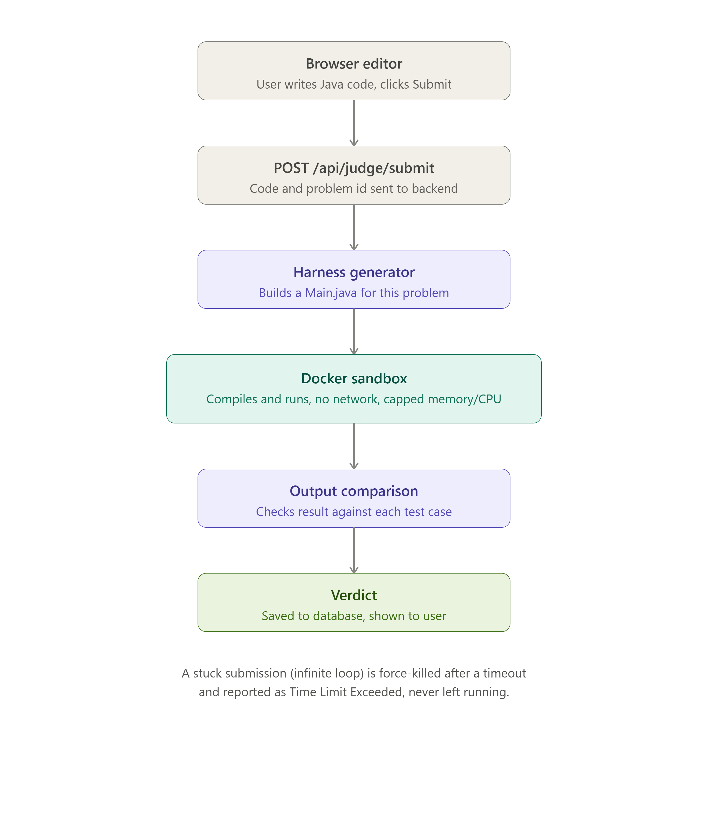

# CodeArena

An online code judge — write Java solutions in-browser, submit them, and get instant feedback against hidden test cases. Built to understand how platforms like LeetCode and Codeforces actually judge code safely.

## What it does

- Browse coding problems, filtered by difficulty and tags
- Write and test Java solutions in an in-browser editor (Monaco)
- Submit code and get a real verdict: Accepted, Wrong Answer, Compilation Error, Runtime Error, or Time Limit Exceeded
- Track solved problems and submission history on a personal dashboard

## Why this project

Most beginner projects are CRUD apps. I wanted to build something with a genuinely hard technical core: **safely running code that a stranger wrote, on my own server, without letting it break anything.** That's the real problem every online judge has to solve.

## Architecture

**Request flow for a submission:**
1. User writes code in the Monaco editor and clicks Submit
2. Frontend sends the code to `POST /api/judge/submit`
3. Backend generates a `Main.java` test harness specific to that problem (parses input, calls the user's method, prints the result)
4. Backend writes the user's code + generated harness to a temp folder
5. A Docker container is spun up, with that folder mounted in — no network access, capped CPU/memory, and a hard timeout
6. Inside the container: compile, then run against each test case's input
7. Output is compared against expected output; first mismatch determines the verdict
8. Verdict is saved to the database and returned to the browser

## Key design decisions

**Docker sandboxing, not direct execution** — Running a stranger's code directly in my server process would let them read environment variables, kill the process, or loop forever and hang the server. Docker gives every submission an isolated, disposable environment with `--network=none` (no internet access) and capped memory/CPU, so the worst case is one throwaway container getting killed.

**Dynamic test harness generation, not "paste a full program"** — Rather than asking users to write their own `main()` and handle I/O parsing (which real judges don't require), each problem stores its method signature and parameter types. The backend generates a matching `Main.java` on the fly that parses stdin into the right Java types, calls the user's method, and prints the result in a comparable format.

**Timeout handling via background threads** — Reading a stuck program's output would block forever before ever reaching a timeout check. Output is read on background threads in parallel with a `waitFor(timeout)` call, so an infinite loop gets killed and reported as Time Limit Exceeded instead of hanging the request.

**Session-based auth over JWT** — Since the frontend is server-rendered (Thymeleaf), sessions are a more natural fit than managing tokens client-side, and Spring Security handles this with minimal custom code.

## Tech stack

- **Backend:** Spring Boot, Spring Security, Spring Data JPA
- **Database:** PostgreSQL
- **Frontend:** Thymeleaf, Monaco Editor
- **Execution:** Docker (Java 21 runtime), invoked via `ProcessBuilder`

## What I'd improve next

- Move execution off the request thread with a proper queue (RabbitMQ/Spring `@Async`) so submissions don't block while a container runs
- Support more languages beyond Java
- Admin UI for adding problems instead of a hardcoded seeder

## Running locally

1. Clone the repo
2. Create a PostgreSQL database named `codearena`
3. Update `application.properties` with your DB credentials
4. Make sure Docker Desktop is running
5. Run `mvn spring-boot:run`
6. Visit `http://localhost:8080`
